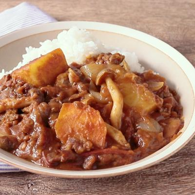

# カレーの作り方

### 材料（2人前）
- ごはん　　　　　　        　　　400g
- 牛こま切れ肉　　　        　　　200g
- 玉ねぎ (200g)　   　　　 　1個
- トマト (450g)　　　　　　3個
- にんじん (100g)　　　　　1/2本
- じゃがいも (100g)　　　　1個
- しめじ (50g)　　　　　　　1/2パック
- (A)すりおろしニンニク　　小さじ1/2
- (A)すりおろし生姜　　　　小さじ1/2
- カレールー　　　　　　　　40g
- サラダ油　　　　　　　　小さじ2
  
### 作り方
準備. じゃがいもは皮を剥き、芽をとっておきます。 にんじんは皮を剥いておきます。 トマトはヘタを取っておきます。  
1.　玉ねぎは1cm幅に切ります。  
2.　にんじんは乱切り、じゃがいもは一口大に切りま　 す。  
3.　しめじは石づきを取り除き、手でほぐします。  
4.　トマトはざく切りにします。  
5.　鍋にサラダ油、(A)を入れて熱し、香りが立ったら1を入れて中火でしんなりするまで炒めます。  
6.　牛こま切れ肉を入れて炒め、色が変わってきたら2、3を加え中火で全体を炒め合わせます。  
7.　4を入れて蓋をし、時々混ぜながら弱火で15分程煮ます。  
8.　にんじんとじゃがいもが柔らかくなったらカレールーを溶かし、弱火で10分程煮込み全体に味が馴染んだら火から下ろします。  
9.　お皿にごはんを盛り付け、8をかけたら完成です。  

### 料理のコツ・ポイント
- カレールーの量は、お好みで調整してください。
- 水を加えずに作るため焦げやすいので火加減に気をつけてください。
- 鶏肉や豚肉などお好みのお肉でお作りください。